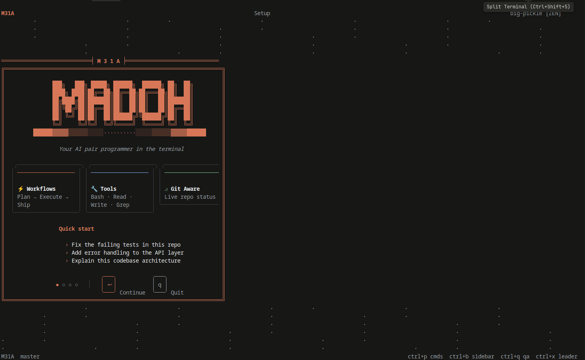
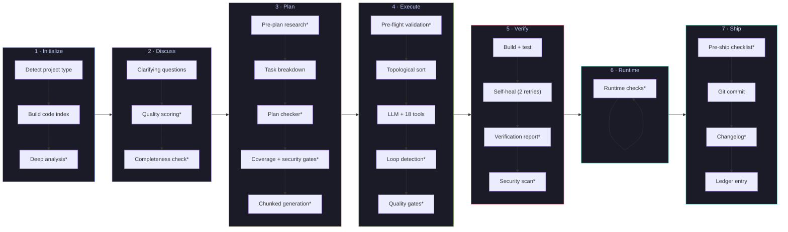
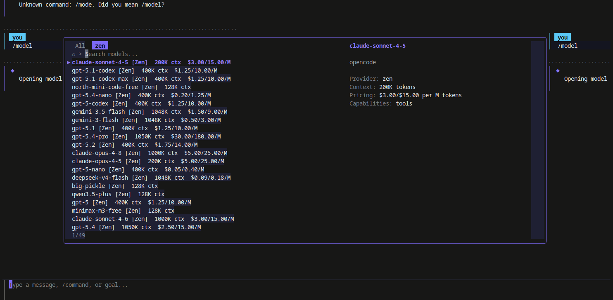
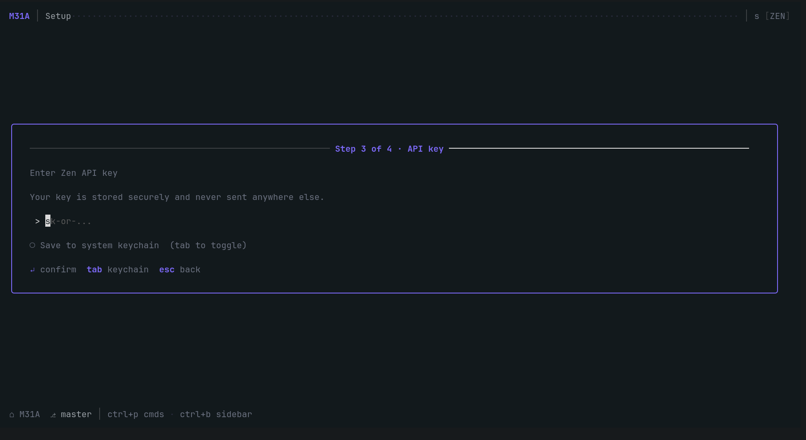
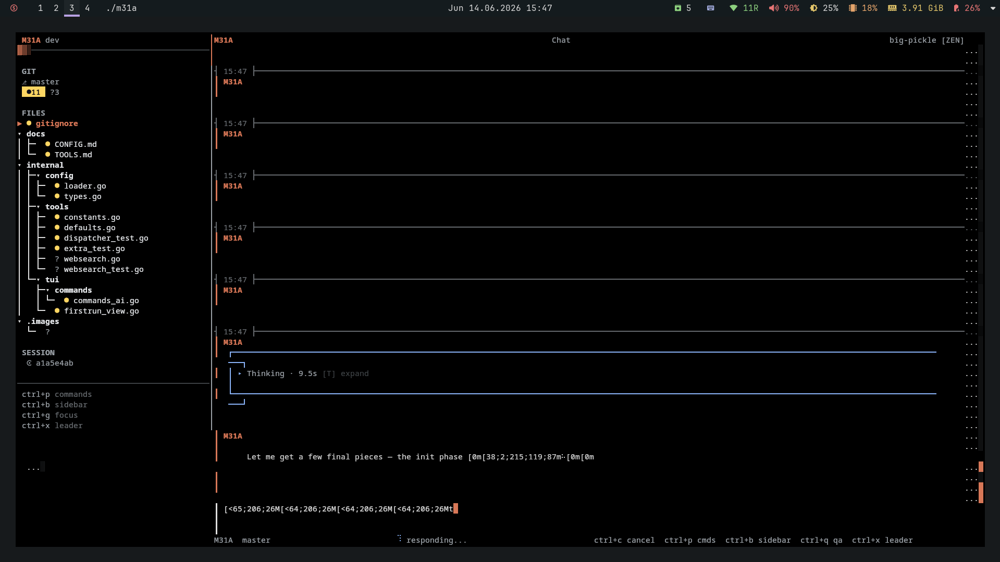
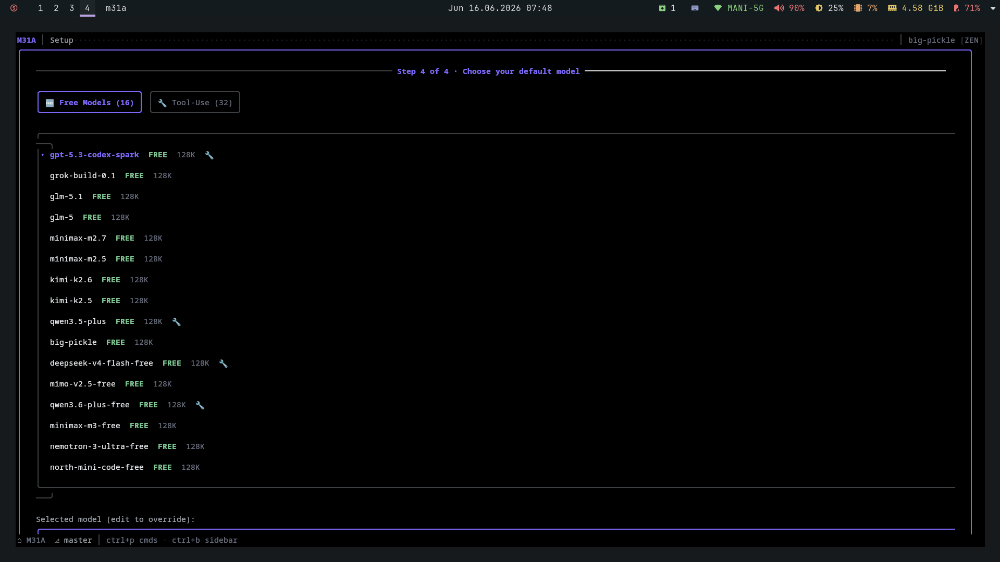

<div align="center">

# M31 Autonomous

### The terminal-native AI coding agent that ships, not just suggests.

**Seven-phase workflow · Git rollback chain · Zero telemetry · One static binary**

[](go.mod)
[](LICENSE)
[](https://github.com/eshanized/M31A/releases)
[](https://github.com/eshanized/M31A/actions)
[](https://goreportcard.com/report/github.com/eshanized/M31A)
[](https://github.com/eshanized/M31A/stargazers)

[Install](#install) · [Wiki](https://github.com/eshanized/M31A/wiki) · [Features](#features) · [How It Works](#how-it-works) · [Contributing](CONTRIBUTING.md) · [Report a Bug](https://github.com/eshanized/M31A/issues/new?template=bug_report.md)

</div>

---

<p align="center">
  
</p>

M31 Autonomous is a terminal-based AI coding agent written in Go. Unlike browser-bound assistants, it runs inside your shell, owns the seven-phase workflow end-to-end — **Initialize, Discuss, Plan, Execute, Verify, Runtime, Ship** — and commits verified changes to your git tree. One static binary, zero telemetry, any POSIX shell.

```
$ m31a
 ╭──────────────────────────────────────────╮
 │  Initialize → Discuss → Plan → Execute   │
 │            → Verify  → Ship              │
 ╰──────────────────────────────────────────╯

 > refactor the auth middleware to use JWT with
   RS256, keep backward compat for 30 days
```

> **Status:** v1.7.0 — production-ready with engine decomposition, externalized config, and hardened security.

## Install

Pick your weapon.

```bash
# macOS (Homebrew)
brew install eshanized/tap/m31a

# Windows (Scoop)
scoop install m31a

# Linux packages (.deb, .rpm, .apk)
# Download from https://github.com/eshanized/M31A/releases

# Linux / macOS (one-liner)
curl -fsSL https://raw.githubusercontent.com/eshanized/M31A/master/install.sh | bash

# From source (any OS)
git clone https://github.com/eshanized/M31A.git
cd M31A
CGO_ENABLED=0 go build -o m31a ./cmd/m31a
```

On first launch, M31 Autonomous prompts for your OpenRouter, Zen, or Nvidia API key. Keys are stored in the OS keychain — **never written to disk in plaintext**.

## Why M31 Autonomous?

Every AI coding tool generates code and walks away. You verify, test, and commit. **M31 Autonomous owns the full loop.**

| | M31 Autonomous | Cursor | Aider | Cline |
|---|:---:|:---:|:---:|:---:|
| Terminal-native (no Electron) | **yes** | no | yes | no |
| Seven-phase workflow engine | **yes** | no | no | no |
| Git commit rollback chain | **yes** | no | partial | no |
| Cross-session learning ledger | **yes** | no | no | no |
| AutoDream context consolidation | **yes** | no | no | no |
| Model arbitrage (cost optimizer) | **yes** | no | no | no |
| Provider auto-fallback (3 providers) | **yes** | no | partial | partial |
| Code intelligence (4 languages) | **yes** | yes | limited | no |
| Workflow modes (full/fast/direct) | **yes** | no | no | no |
| Static binary, no CGO | **yes** | no | no | no |
| Telemetry / phone-home | **none** | yes | none | yes |
| Cost per month | **~$0.01/task** | $20/mo | ~$0.01/task | ~$0.01/task |

M31 Autonomous is the tool you reach for when you want an agent that **owns the loop** — not just an autocomplete with `rm -rf` access.

## How It Works

Every coding task goes through seven phases. The workflow engine supports four modes — **auto** (adaptive), **full** (all 7 phases), **fast** (skip Plan), and **direct** (skip Discuss, Plan, Verify) — so you can dial the process to match the task.



*\* Optional enhancements — toggle individually via `[features]` in config.*

| Phase | What Happens |
|-------|-------------|
| **Initialize** | Detects project type (Go/Node/Rust/Python), builds code intelligence index — import graphs, symbol lookup, relevance scoring across 4 languages. Optional deep project analysis and environment pre-flight checks. |
| **Discuss** | LLM asks clarifying questions, you answer in the TUI. Built-in quality scoring and answer completeness checks ensure the LLM gathers enough context. |
| **Plan** | Optional pre-plan research step, then structured task plan with file predictions (`[NEW]`/`[MODIFY]`), dependencies, and acceptance criteria. Plan checker runs revision loops with coverage and security gates. Large plans auto-chunk for reliability. |
| **Execute** | Tasks run in dependency order (Kahn's topological sort) with bounded parallelism. The LLM makes tool calls via 18 built-in tools, sees results, iterates. Includes pre-flight validation, tool-call loop detection, and per-task quality gates. |
| **Verify** | Runs your build and test suite. Failed tasks trigger self-healing — error output goes back to the LLM, up to 2 retries. Generates a structured verification report and optional security file scanning. |
| **Runtime** | Dev server lifecycle management, HTTP smoke tests, and route discovery. |
| **Ship** | Pre-ship checklist, final verified commit, auto-generated changelog, and session metrics recorded in the cross-session learning ledger. |

## Features

### Workflow & Intelligence

- **Seven-phase workflow** — `Initialize → Discuss → Plan → Execute → Verify → Runtime → Ship` with four modes (`auto`, `full`, `fast`, `direct`) to match task complexity. Every run ends with a verified git commit and a ledger entry.
- **Workflow quality gates** — Plan checker with revision loops, coverage gates, security heuristics, and gap analysis. Discuss-phase quality scoring and completeness checks. Execute-phase pre-flight validation and tool-call loop detection.
- **Engine decomposition** — PhaseCoordinator, StateMachine, WorkflowCache, ContextBuilder, CostTracker, and PromptBuilder extracted from monolithic Engine for cleaner separation of concerns.
- **Code intelligence** — Parses Go (via tree-sitter), TypeScript, Python, and Rust. Builds import dependency graphs, indexes symbols, scores file relevance. The LLM gets context about which files matter for the current task.
- **Decision logger** — In-memory structured decision receipts with rationale, alternatives, cost tracking, non-blocking ring-buffer logging, and automatic secret redaction.
- **Code complexity analysis** — `CodeComplexity` tool classifies your codebase as simple (<10K lines), moderate (10K–50K), or complex (50K+) across all 4 languages, informing model selection.
- **18 built-in tools** — `Bash`, `FileRead`, `FileWrite`, `Edit`, `Glob`, `Grep`, `WebFetch`, `WebSearch`, `CodeMap`, `CodeComplexity`, `FileDelete`, `FileMove`, `FileList`, `TodoWrite`, `TodoRead`, `DevServer`, `HTTPCheck`, `AskUserQuestion`. All gated by a permission system with rate limiting and concurrency control.
- **Parallel subagents** — The LLM can spawn child agents (up to depth 2) that run in isolated git worktrees, each with their own dispatcher and permissions.
- **Task runner** — Kahn's algorithm for topological sort, bounded parallelism (4 concurrent), per-task timeouts, retry support.
- **Narrative engine** — Transforms low-level execution events into human-readable progress descriptions with classification, templating, and timing-based deduplication.

### Model & Provider

- **Triple provider support** — OpenRouter (300+ models), OpenCode Zen, and Nvidia NIM gateways with automatic fallback when a provider degrades. Configurable custom base URLs for self-hosted or proxied gateways.
- **Model arbitrage** — Classifies task complexity (simple/moderate/complex) and recommends the cheapest model that meets quality requirements. Complex tasks require 64K+ context windows.
- **Per-phase model assignment** — Use a cheap model for Discuss/Plan, powerful model for Execute/Verify/Ship. Eight configurable phase slots.
- **AutoDream context compression** — Long conversations get automatically consolidated. Protected messages (initial goal, tool calls, plans, last 5 messages) are never compressed. Auto-compression triggers on context window overflow.
- **Token estimation** — tiktoken-based with EMA self-calibration. Context warning banner at 80%, hard reject at 95%. Configurable warning threshold and EMA alpha.
- **Multi-provider token estimation** — Runtime capability detection across providers with fallback estimation strategies.

### Safety & Privacy

- **Commit rollback chain** — Every task gets its own commit. `git bisect` integration finds the offending commit when verification fails. Backup branches created before any destructive reset.
- **Permission system** — Every `Bash` command is gated by a modal: allow / allow always / deny / exit. Configurable rules, risk levels, per-agent profiles. Rate-limited with token bucket (20 burst / 10 sustained) and stricter limits for dangerous tools (5 burst / 2 sustained).
- **Concurrency control** — Max 8 concurrent tool executions via semaphore. Dangerous commands have an additional blocklist for defense-in-depth.
- **OS keychain** — Linux (dbus/secret-service), macOS (Keychain), Windows (Credential Manager). One code path, three backends. API keys **never written to disk in plaintext**.
- **Zero telemetry** — No phone-home, no analytics, no data collection. Works offline once model catalog is cached.
- **SSRF + DNS rebinding protection** — WebFetch blocks private, loopback, and link-local IP addresses. WebSearch uses a DNS cache to prevent TOCTOU rebinding attacks.
- **Path traversal prevention** — Keychain service paths sanitized to block traversal attacks.
- **Command injection hardening** — Bash command detection normalized to catch obfuscation attempts.
- **Edit safety** — 7-strategy cascade replacement with collision-safe backups and replace-all support.

### Terminal UI

- **33-screen Bubble Tea TUI** — Everblush single dark theme, Vim-style navigation, leader key shortcuts (`Ctrl+X`), command palette (`Ctrl+P`).
- **Fuzzy model selector** — search with per-token cost comparison and live context-warning.
- **Diff viewer** — browse git diffs inline with syntax highlighting.
- **Rollback browser** — view commit chain, soft/hard reset with preview.
- **File explorer** — tree view with syntax highlighting.
- **Dashboard** — workflow pipeline overview with phase progress, current goal, and activity timeline.
- **Chat history** — browse and search past conversations within a session.
- **Session persistence** — resume mid-workflow after `Ctrl+C`, network drops, or laptop sleep.
- **Accessibility** — reduced motion mode, configurable animation speed, opacity controls, and breathing effects.
- **Streaming performance** — Lightweight streaming markdown parser, viewport virtualization, resize debounce, and 10fps render rate.
- **First-time experience** — Quick mode, `/help getting-started`, `/skip` commands, and getting-started tour.
- **Keyboard-first navigation** — Breadcrumb navigation, visible focus indicators, and help screen synced with actual keybindings.

## Quick Tour

### The REPL

```
 /help          list all commands
 /workflow      kick off the seven-phase flow
 /model         open the model selector (fuzzy search)
 /provider      switch provider (openrouter/zen/nvidia)
 /ledger stats  show your cross-session ledger
 /rollback      show the commit chain; --hard to reset
 /compress      trigger AutoDream manually
 /agent         spawn parallel subagents
 /diff          browse git diffs
 /dashboard     workflow pipeline overview
 /ghost         ghost write files
 /bisect        compare model outputs side-by-side
 /memory        manage context memory (view/pause/resume/revert)
```

Full command reference: [`docs/SLASH_COMMANDS.md`](docs/SLASH_COMMANDS.md)

### Headless Mode

```bash
# Single prompt (no TUI)
m31a --prompt "What files are in the project?"

# Full workflow execution
m31a --goal "Create a REST API with authentication and database"
```

### Key Bindings

| Key | Action |
|---|---|
| `Enter` | Send message in REPL |
| `Ctrl+C` | Cancel active stream; second press exits |
| `Ctrl+P` | Open command palette |
| `Ctrl+Q` | Open quick actions |
| `Esc` | Close model selector / modals |
| `y` / `a` / `n` / `e` | Permission modal: allow / allow always / deny / exit |
| `Ctrl+X` + key | Leader shortcuts (settings, model, theme, rollback, etc.) |

Full keymap: [`docs/KEYBINDINGS.md`](docs/KEYBINDINGS.md)

### Configuration

`~/.m31a/config.toml` (override with `M31A_CONFIG`):

```toml
[provider]
default = "openrouter"
auto_fallback = true
fallback_priority = ["openrouter", "zen", "nvidia"]
health_check_timeout_secs = 10
registration_order = "config"

[model]
default = ""
auto_arbitrage = false
arbitrage_threshold = 0.1
show_thinking_by_default = false
token_ema_alpha = 0.3
capability_overrides = {}

[ui]
theme = "dark"
compact_mode = false
show_cost_estimate = true
sidebar_position = "right"
animation_speed = "normal"
reduced_motion = false
welcome_screen = true

[permissions]
default_mode = "prompt"
timeout_seconds = 300

[features]
auto_backup = true
resume_on_startup = false
workflow_mode = "auto"
budget_limit_usd = 0
metrics_enabled = true
plan_research = true
plan_check = true
plan_security_gate = true
plan_coverage_gate = true
plan_chunked = true
discuss_quality_check = true
discuss_completeness = true
execute_preflight = true
execute_loop_detect = true
verify_report = true
ship_preflight = true
ship_changelog = true
init_deep_analysis = true

[tools]
max_glob_results = 1000
max_grep_results = 100
bash_kill_grace_secs = 5
websearch_enabled = true
dangerous_command_overrides = []

[prompts]
override_dir = ""
dynamic_limits = true

[narrative]
template_overrides = {}

[ui.theme_config]
logo = ""
welcome = ""
symbols = {}

[git]
commit_prefix = "feat"
fix_prefix = "fix"
ship_prefix = "chore"

[verify]
build_command = ""
test_command = ""

[agents]
default = ""
plan = ""
execute = ""
verify = ""
ship = ""
discuss = ""
```

Full reference: [`docs/CONFIG.md`](docs/CONFIG.md)

## Architecture

```mermaid
graph TB
    subgraph entry["cmd/m31a"]
        main["main.go<br/>entry point"]
        usage["usage.go<br/>CLI flags"]
    end

    subgraph internal["internal/ (private)"]
        direction TB
        tui["tui/<br/>33 screens<br/>Bubble Tea app"]
        workflow["workflow/<br/>seven-phase engine<br/>quality gates · chunked plans"]
        provider["provider/<br/>openrouter · zen · nvidia<br/>fallback · cache · SSE"]
        tools["tools/<br/>18 tools · permissions<br/>rate limiting · concurrency"]
        subagent["tools/subagent/<br/>parallel subagents<br/>worktree isolation · depth=2"]
        codeintel["codeintel/<br/>4-language parser<br/>import graph · relevance"]
        config["config/<br/>TOML loader · hot-reload<br/>project context detection"]
        context["context/<br/>dynamic context<br/>registry · diff notifications"]
        decision["decision/<br/>decision receipts<br/>ring buffer · redaction"]
        git["git/<br/>commit · rollback<br/>diff · stash · branch"]
        logging["logging/<br/>audit logging<br/>secret redaction"]
        shell["shell/<br/>platform-aware<br/>command execution"]
        tokens["tokens/<br/>tiktoken estimation<br/>EMA calibration"]
        types["types/<br/>shared types · constants<br/>workflow modes · risk levels"]
        wiring["wiring/<br/>integration<br/>regression tests"]
        fileutil["fileutil/<br/>atomic file operations"]
        errors["errors/<br/>sentinel errors"]

        tools --> subagent
    end

    subgraph pkg["pkg/ (public, importable)"]
        direction TB
        session["session/<br/>lifecycle · persistence"]
        ledger["ledger/<br/>cross-session learning<br/>markdown-backed"]
        rollback["rollback/<br/>commit-chain manager<br/>soft · hard · safe reset"]
        bisect["bisect/<br/>git-bisect wrapper"]
        taskrunner["taskrunner/<br/>Kahn's algorithm<br/>bounded parallelism"]
        keychain["keychain/<br/>OS keychain<br/>Linux · macOS · Windows"]
        autodream["autodream/<br/>context consolidation<br/>reentrancy guard"]
        arbitrage["arbitrage/<br/>model-cost optimizer"]
        compaction["compaction/<br/>session compaction<br/>LLM summarization"]
        coordinator["coordinator/<br/>drain sessions<br/>coalescing · interrupt"]
        history["history/<br/>frecent prompt history<br/>scoring"]
        metrics["metrics/<br/>session metrics<br/>JSON persistence"]
        narrative["narrative/<br/>event → progress<br/>description transformer"]
        retry["retry/<br/>exponential backoff<br/>error classification"]
    end

    main --> internal
    internal --> pkg

    style entry fill:#1a1b26,stroke:#7aa2f7,color:#c0caf5
    style internal fill:#1a1b26,stroke:#bb9af7,color:#c0caf5
    style pkg fill:#1a1b26,stroke:#9ece6a,color:#c0caf5
```



### Package Summary

| Package | Description |
|---------|-------------|
| `cmd/m31a/` | Binary entry point with CLI flags |
| `internal/tui/` | Bubble Tea TUI app — 33 screens, responsive layout, command palette |
| `internal/workflow/` | Seven-phase orchestration engine with quality gates, chunked plans, and pre-flight checks |
| `internal/provider/` | OpenRouter, Zen, and Nvidia clients with auto-fallback, model cache, and SSE streaming |
| `internal/tools/` | 18 tools with permission system, token-bucket rate limiting, and concurrency control |
| `internal/tools/subagent/` | Parallel subagent manager with git worktree isolation (max depth 2) |
| `internal/codeintel/` | 4-language parser (Go, TypeScript, Python, Rust) with import graph and relevance scoring |
| `internal/config/` | TOML loader with project context detection, hot-reload, and workflow enhancement flags |
| `internal/context/` | Dynamic context registry tracking, reconciling, and rendering changes between LLM calls |
| `internal/decision/` | Structured decision receipts with rationale, cost tracking, and ring-buffer logging |
| `internal/git/` | Commit, rollback, diff, stash, and branch operations |
| `internal/logging/` | Audit and security utilities with secret redaction and source scanning |
| `internal/shell/` | Platform-aware shell command execution (Unix/Windows abstraction) |
| `internal/tokens/` | tiktoken-based estimation with EMA self-calibration |
| `internal/types/` | Shared types, constants, workflow modes, risk levels, and plan structures |
| `internal/wiring/` | End-to-end integration regression tests |
| `internal/fileutil/` | Atomic file write operations |
| `internal/errors/` | Sentinel errors with user-friendly messages |
| `pkg/session/` | Session lifecycle and persistence (JSON in `~/.m31a/sessions/`) |
| `pkg/ledger/` | Cross-session learning store (markdown-backed) |
| `pkg/rollback/` | Commit-chain manager (soft/hard/safe reset) |
| `pkg/bisect/` | Git-bisect wrapper for model comparison |
| `pkg/taskrunner/` | Parallel task executor with Kahn's algorithm and bounded parallelism |
| `pkg/keychain/` | OS keychain abstraction (Linux dbus, macOS Keychain, Windows Credential Manager) |
| `pkg/autodream/` | Context consolidation with reentrancy guard |
| `pkg/arbitrage/` | Model-cost optimizer with task classification |
| `pkg/compaction/` | Automatic session compaction with LLM-summarized context replacement |
| `pkg/coordinator/` | Concurrent drain session management with coalescing and interrupt support |
| `pkg/history/` | Frecent prompt history with scoring |
| `pkg/metrics/` | Thread-safe session metrics collector with JSON persistence |
| `pkg/narrative/` | Execution event to human-readable progress description transformer |
| `pkg/retry/` | Configurable retry policy with exponential backoff and error classification |
| `pkg/skills/` | Skill management and slash command registration |

Deep dive: [`docs/ARCHITECTURE.md`](docs/ARCHITECTURE.md) · [Wiki](https://github.com/eshanized/M31A/wiki)

## Screenshots

<p align="center">
  
  
</p>

<p align="center">
  
  
</p>

## Project Layout

```
.
├── cmd/m31a/          entry point
├── docs/              architecture, config, workflow, tools, screens, troubleshooting
├── internal/          private packages (not importable)
│   ├── codeintel/     4-language parser, import graph, relevance scoring
│   ├── config/        TOML loader, project context, hot-reload
│   ├── context/       dynamic context registry, diff notifications
│   ├── decision/      decision receipts, ring buffer, redaction
│   ├── errors/        sentinel errors
│   ├── fileutil/      atomic file operations
│   ├── git/           commit, rollback, diff, stash, branch
│   ├── logging/       audit logging, secret redaction
│   ├── provider/      openrouter, zen, nvidia clients
│   ├── shell/         platform-aware command execution
│   ├── tokens/        tiktoken estimation, EMA calibration
│   ├── tools/         18 tools + subagent manager
│   ├── tui/           Bubble Tea app (33 screens)
│   ├── types/         shared types, constants, workflow modes
│   ├── wiring/        integration regression tests
│   └── workflow/      seven-phase engine, quality gates
├── pkg/               public packages (importable)
│   ├── arbitrage/     model-cost optimizer
│   ├── autodream/     context consolidation, reentrancy guard
│   ├── bisect/        git-bisect wrapper
│   ├── compaction/    session compaction, LLM summarization
│   ├── coordinator/   drain session management, coalescing
│   ├── history/       frecent prompt history, scoring
│   ├── keychain/      OS keychain abstraction
│   ├── ledger/        cross-session learning store
│   ├── metrics/       session metrics, JSON persistence
│   ├── narrative/     event to progress description transformer
│   ├── retry/         exponential backoff, error classification
│   ├── rollback/      commit-chain manager
│   ├── session/       session lifecycle, persistence
│   ├── skills/        skill management
│   └── taskrunner/    Kahn's algorithm, bounded parallelism
├── scripts/           verify_v1.sh acceptance suite
├── install.sh         one-liner installer
├── Makefile           build / test / lint / release targets
└── .goreleaser.yaml   cross-compile + release config
```

## Development

```bash
git clone https://github.com/eshanized/M31A.git
cd M31A

make build          # optimized binary
make test           # race-enabled tests
make lint           # golangci-lint + gofmt check
make dev            # build + run
make cover          # test + coverage report
make bench          # benchmarks
make help           # list all targets
```

Coverage targets: **75%** overall, **90%** for `pkg/taskrunner`, `pkg/bisect`, `pkg/rollback`.

See [`CONTRIBUTING.md`](CONTRIBUTING.md) for code style, architecture rules, and PR conventions.

## Security

M31 Autonomous executes shell commands on your behalf. Security is layered:

| Layer | Mechanism |
|-------|-----------|
| **Permission modal** | Every `Bash` command gated: allow / allow always / deny, with configurable timeout and default `ask` mode |
| **Rate limiting** | Token bucket: 20 burst / 10 sustained for normal tools; 5 burst / 2 sustained for dangerous tools |
| **Concurrency control** | Max 8 concurrent tool executions via semaphore |
| **Command blocklist** | Dangerous command patterns blocked at the tool boundary (defense-in-depth) |
| **Path traversal** | Blocked at tool boundary; size limits (50MB per file read), stream-size caps |
| **Keychain path traversal** | `sanitizeService` blocks traversal in keychain service names |
| **SSRF protection** | WebFetch blocks private, loopback, and link-local IP addresses |
| **DNS rebinding** | WebSearch uses a DNS cache (5 min TTL) to prevent TOCTOU rebinding attacks |
| **Edit safety** | 7-strategy cascade with collision-safe backups |
| **Command injection** | Normalized detection catches obfuscation attempts |
| **Subagent depth** | Max nesting depth of 2 to prevent runaway agent spawning |

See [`SECURITY.md`](SECURITY.md) to report vulnerabilities. See [`docs/TOOLS.md`](docs/TOOLS.md) for the full tool security model.

## Roadmap

- [x] **Headless mode** — `--goal` flag for workflow execution without TUI (v1.6)
- [x] **Subagents** — parallel child agents with git worktree isolation (v1.0)
- [x] **Code intelligence** — 4-language parser with import graph and relevance scoring (v1.0)
- [x] **Workflow quality gates** — plan checker, coverage gates, security heuristics, loop detection (v1.0)
- [x] **Nvidia NIM provider** — third provider with auto-fallback (v1.0)
- [x] **Code complexity analysis** — polyglot codebase classifier informing model selection (v1.0)
- [x] **Chunked plan generation** — large plans auto-chunk with outline + wave expansion (v1.0)
- [x] **Engine decomposition** — PhaseCoordinator, StateMachine, WorkflowCache extraction (v1.7)
- [x] **Config externalization** — prompt overrides, provider capabilities, UI config (v1.7)
- [x] **Streaming performance** — viewport virtualization, markdown parser, 10fps render (v1.7)
- [ ] **Ghost mode** — fully headless runs that produce a structured diff without touching the TUI
- [ ] **Picture-in-picture** — run a second agent in a side pane for cross-review
- [ ] **Deferred tools** — queue tool calls that require human approval for batch review

## Star History

If M31 Autonomous saves you time, [drop a star](https://github.com/eshanized/M31A) — it's the single most effective way to keep the project alive.

[](https://star-history.com/#eshanized/M31A&Date)

## Citing M31 Autonomous

If you use M31 Autonomous in your research, please cite it:

```bibtex
@software{m31a2026,
  author       = {Eshan Roy},
  title        = {M31 Autonomous: A Terminal-Native AI Coding Agent with Seven-Phase Workflow Orchestration},
  year         = {2026},
  url          = {https://github.com/eshanized/M31A},
  version      = {v1.7.0}
}
```

Or use the bibtex entry above for citation.

## Thanks

Built with [Bubble Tea](https://github.com/charmbracelet/bubbletea), [Lip Gloss](https://github.com/charmbracelet/lipgloss), [Glamour](https://github.com/charmbracelet/glamour), and [tiktoken-go](https://github.com/pkoukk/tiktoken-go).

## License

[MIT](LICENSE) — Copyright (c) Eshanized
