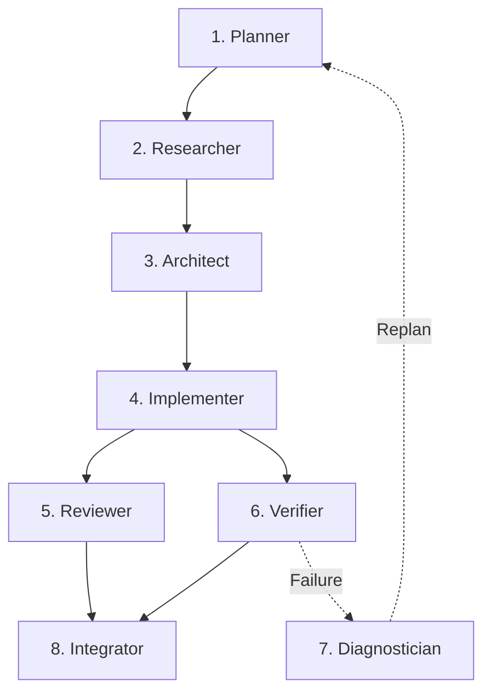

# M31A Runtime Architecture

This document specifies the internal architecture of the M31 Autonomous (M31A) runtime.

## Core Architectural Principle

> **"The model proposes. The runtime decides."**

In M31A, large language models generate structured candidate intents (proposals), but the deterministic runtime owns scheduling, resource allocation, policy evaluation, sandbox isolation, verification gates, state machines, checkpoints, and completion confirmation.

---

## Layered Hierarchy (L0–L9)

The runtime follows a strict unidirectional dependency architecture organized into 10 layers:

| Layer | Subsystem | Responsibilities |
|:---|:---|:---|
| **L9** | CLI / TUI / Integrations | Command parsing, Ratatui cockpit, telemetry inspection, JSON export, evaluation runner. |
| **L8** | Autonomy Controller | 12-stage mission execution loop, budget tracker, loop detector, completion gates. |
| **L7** | Verification / Recovery | Multi-tier test validation, failure classifier, differential DAG replanner, two-phase checkpoints. |
| **L6** | Execution Engine | Job manager, process tree supervisor, streaming output spools, immutable artifact store. |
| **L5** | Planning / DAG Engine | TaskGraph reconciler, topological scheduler, candidate plan validator, task state machines. |
| **L4** | Agent Coordination | Role-specific agents, context window compilers, token allocators, agent lifecycle states. |
| **L3** | Intelligence Boundary | Model provider abstraction, structural proposal introspection, multi-tier SecretRedactor, XML prompt trust envelopes with attribute escaping. |
| **L2** | Capabilities & Tools | 28 core tools, 15 capability families, cgroups v2 / rlimits process confinement, deny-by-default EnvironmentBuilder, shell safety inspection. |
| **L1** | Security & Policy | 11-stage policy gate, NetworkDestinationPolicy (SSRF/private IP egress blocking), worktree isolation authority boundary, approval coordinator. |
| **L0** | Runtime Kernel | Strongly typed domain IDs (`MissionId`, `TaskId`, `JobId`), error types, base traits. |

Lower layers are strictly prohibited from importing or depending on higher layers.

---

## The 12-Stage Autonomy Controller Loop

Every mission is orchestrated by the `AutonomyController` through a 12-stage deterministic execution lifecycle:

1. **Intake & Validation**: Ingests mission objective, resolves effective profile, validates configuration invariants.
2. **Context Compilation**: Gathers workspace structure, baseline commit, and active security rules into XML trust envelopes.
3. **Plan Generation**: Consults planning model to generate a structured `CandidatePlan` containing tasks and dependencies.
4. **DAG Reconciliation**: Reconciles the candidate plan with the existing `TaskGraph`, preserving completed tasks across revisions.
5. **Topological Scheduling**: Selects ready tasks whose dependencies are satisfied; verifies budget grants.
6. **Agent Dispatch**: Instantiates specialized agents according to assigned roles (`AgentRole`).
7. **Two-Phase Reservation**: Pre-allocates token, memory, and step quotas with `BudgetEnforcer::reserve`.
8. **Tool Execution & Policy Gate**: Evaluates candidate tool calls through `PolicyGate` (ALLOW/DENY/ASK); invokes sandboxed tools.
9. **Post-Execution Settlement**: Settles actual consumed resources and records structured execution telemetry.
10. **Evidence-Based Verification**: Runs multi-tier checks (compilation, unit tests, linters, semantic reviews).
11. **Checkpointing**: Captures atomic two-phase snapshots (`CheckpointManifest`) committing staged artifacts.
12. **Completion Gating**: Evaluates `CompletionGate`; generates signed completion reports with durable evidence links.

---

## Canonical Agent Roles

The runtime partitions autonomous engineering tasks across 8 specialized agent roles:



1. **`planner` (`AgentRole::Planner`)**: Analyzes high-level objectives, decomposes requirements, and generates acyclic candidate task DAGs.
2. **`researcher` (`AgentRole::Researcher`)**: Explores codebase structure, index symbols, reads documentation, and surveys library dependencies.
3. **`architect` (`AgentRole::Architect`)**: Defines cross-module interfaces, contract types, API boundaries, and architectural patterns.
4. **`implementer` (`AgentRole::Implementer`)**: Authors concrete source code modifications, writes tests, and applies targeted patches within permitted files.
5. **`reviewer` (`AgentRole::Reviewer`)**: Performs semantic code reviews, auditing proposed diffs for security, maintainability, and regression risks.
6. **`verifier` (`AgentRole::Verifier`)**: Executes automated test suites, type checking, formatting, and linter pipelines; produces cryptographic verification evidence.
7. **`diagnostician` (`AgentRole::Diagnostician`)**: Analyzes failed verification runs, compiler diagnostics, and runtime exceptions; classifies failure modes.
8. **`integrator` (`AgentRole::Integrator`)**: Consolidates verified worktrees, stages changes, generates RFC-compliant commit trailers, and prepares merge artifacts.
9. **`discovery_analyst` (`AgentRole::DiscoveryAnalyst`)**: Drives Socratic discovery interviews, extracts constraints across four pillars, and synthesizes `PROJECT.md`.
10. **`stack_researcher` (`AgentRole::StackResearcher`)**: Researches languages, toolchains, package ecosystems, and dependency viability into `STACK.md`.
11. **`features_researcher` (`AgentRole::FeaturesResearcher`)**: Analyzes table stakes, differentiators, anti-features, and user workflows into `FEATURES.md`.
12. **`architecture_researcher` (`AgentRole::ArchitectureResearcher`)**: Investigates modular topologies, concurrency models, and storage schemas into `ARCHITECTURE.md`.
13. **`pitfalls_researcher` (`AgentRole::PitfallsResearcher`)**: Uncovers performance bottlenecks, concurrency hazards, upstream bugs, and deprecations into `PITFALLS.md`.
14. **`security_researcher` (`AgentRole::SecurityResearcher`)**: Evaluates threat models, authorization boundaries, crypto invariants, and sandboxing into `SECURITY.md`.
15. **`deployment_researcher` (`AgentRole::DeploymentResearcher`)**: Researches process supervisors, containerization, distribution targets, and resource bounds into `DEPLOYMENT.md`.
16. **`synthesizer` (`AgentRole::Synthesizer`)**: Reconciles multi-dimensional research findings, resolves contradictions, and authors `SUMMARY.md`.
17. **`auditor` (`AgentRole::Auditor`)**: Performs independent read-only auditing of architecture, implementation, authority duplication, and production reachability.
18. **`release_certifier` (`AgentRole::ReleaseCertifier`)**: Certifies release readiness across the 20-point production evidence matrix, rejecting "all tests passed" as sufficient.

---

## Core Capability Families

Tools and providers are grouped into 15 strongly typed capability families:

1. **`Filesystem`**: Root-scoped workspace file operations (`read_file`, `write_file`, `edit_file`, `apply_patch`).
2. **`Shell`**: Bounded, isolated shell command invocations with dynamic environment sanitization.
3. **`Process`**: Process group supervision, PID tracking, signal escalation, and execution watchdog.
4. **`Terminal`**: Interactive terminal stream control with ANSI escape filtering.
5. **`Repository`**: Semantic code symbol navigation, AST index queries, and dependency resolution.
6. **`Git`**: Worktree management, staging, diff extraction, history inspection, and commit trailer attribution.
7. **`Web`**: Bounded HTTP fetches and external documentation lookups.
8. **`Network`**: Reachability checks, socket connectivity, and DNS resolution validation.
9. **`Jobs`**: Long-running background processes with output spooling and status tracking.
10. **`Sandbox`**: OS-level confinement boundaries (cgroups v2, POSIX rlimits, directory chroot/jails).
11. **`Model`**: Model provider routing, token tracking, temperature control, and fallback management.
12. **`Memory`**: Fast in-memory key-value state and historical context retrieval.
13. **`Verification`**: Test runners, linters, static analyzers, and test outcome assertions.
14. **`Artifacts`**: Content-addressed blob store with streaming quota enforcement.
15. **`Telemetry`**: Structured event correlation, span collectors, and metric sampling.

---

## Hybrid Persistence Architecture

M31A utilizes a hybrid storage architecture designed for speed, durability, and minimal disk footprint:

```
.m31a/
├── db.sqlite           # Compact authoritative relational state (WAL mode)
├── telemetry/          # High-volume append-only NDJSON execution streams
│   └── <mission_id>.ndjson
├── artifacts/          # Content-addressed SHA-256 blob storage
│   ├── ab/
│   │   └── abcd1234...bin
└── staging/            # Two-phase staging buffers for uncommitted checkpoints
```

1. **SQLite Relational Store (`db.sqlite`)**:
   - Stores authoritative state machines: missions, tasks, checkpoints, baselines, recovery attempts, and completion reports.
   - Enforces WAL (Write-Ahead Logging) and `PRAGMA foreign_keys = ON`.
2. **Append-Only NDJSON Streams (`.m31a/telemetry/`)**:
   - High-throughput, non-blocking telemetry logging for raw spans, tool calls, and model tokens.
   - Secrets are deterministically redacted before bytes hit the file system.
3. **Content-Addressed Artifact Store (`.m31a/artifacts/`)**:
   - Immutable blob storage indexed by SHA-256 hash.
   - Subject to strict streaming quota limits (`StreamingQuotaWriter`) to prevent disk exhaustion.
