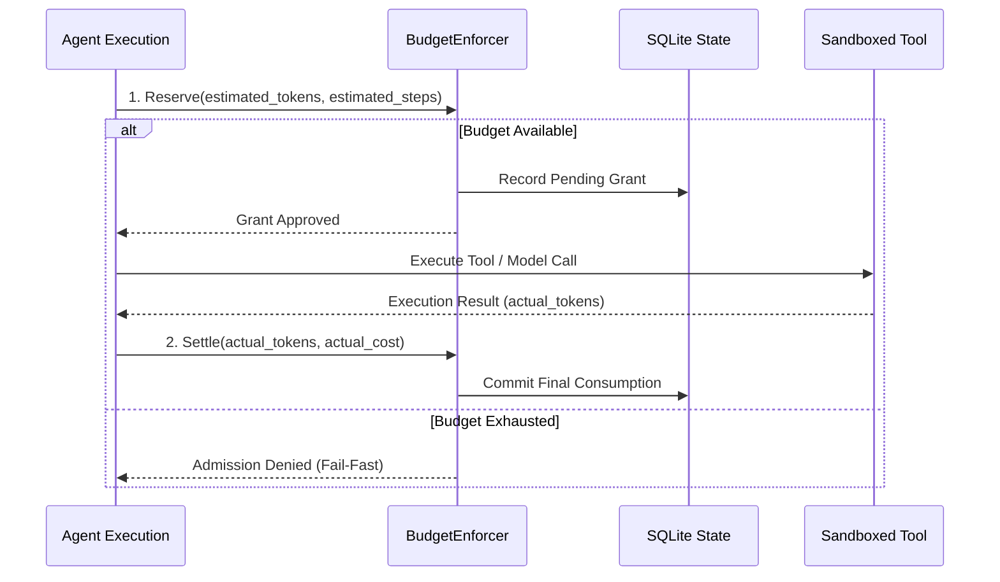

# M31A Autonomy Modes & Execution Loop

This document specifies the autonomy governance model, the 5 autonomy modes, loop stages, sliding-window oscillation detection, two-phase budget reservation, and the 10-dimensional budget enforcer in M31 Autonomous (M31A).

## The 5 Autonomy Modes

M31A supports 5 distinct operational autonomy modes defined in `src/state/intake.rs`:

| Autonomy Mode | Mutating Actions Permitted? | Approval Behavior (`ASK`) | Primary Use Case |
|:---|:---|:---|:---|
| **`Plan`** | No (Strictly Read-Only) | Denied immediately | Architecture planning, DAG generation, codebase inspection. |
| **`Safe`** | Requires Approval | Pauses mission; awaits operator confirmation | Sensitive repositories, production codebases, unfamiliar tasks. |
| **`Assisted`** | Allowed inside Workspace | Pauses mission only for external side effects (git push, network) | Standard interactive developer pairing. |
| **`Autonomous`** | Allowed inside Workspace | Pauses mission only if explicit policy veto triggers `ASK` | Self-directed refactoring, bug fixes, feature implementation. |
| **`Unattended`** | Allowed inside Workspace | **Converts `ASK` to `DENY` fail-closed** (never blocks on stdin) | Headless CI/CD runners, scheduled nightly evaluations. |

---

## The 10-Dimensional Resource Budget Enforcer

Autonomous execution without hard boundaries risks financial loss, infinite loops, and resource exhaustion. M31A enforces a comprehensive **10-dimensional resource budget model** (`ResourceBudget`):

| # | Budget Dimension | Field Name | Type | Enforcement Behavior |
|:---:|:---|:---|:---|:---|
| **1** | Wall-Clock Time | `max_wall_clock_seconds` | `Option<u64>` | Watchdog timer halts mission if total duration is exceeded. |
| **2** | Concurrent Agents | `max_concurrent_agents` | `Option<usize>` | Scheduler bounds active parallel agent execution pool. |
| **3** | Agent Steps | `max_agent_steps` | `Option<usize>` | Limits total decision cycles executed per agent. |
| **4** | Model Invocations | `max_model_calls` | `Option<usize>` | Restricts cumulative LLM inference requests. |
| **5** | Token Usage | `max_tokens` | `Option<u64>` | Pre-admission reservation rejects calls exceeding token quota. |
| **6** | Financial Cost | `max_cost_usd` | `Option<f64>` | Tracks dollar expenditure across models; halts when breached. |
| **7** | Process CPU Time | `max_cpu_seconds` | `Option<u64>` | POSIX `RLIMIT_CPU` / cgroups clamp child process CPU. |
| **8** | Memory Footprint | `max_memory_bytes` | `Option<u64>` | POSIX `RLIMIT_AS` / cgroups `memory.max` clamp process RAM. |
| **9** | Artifact Storage | `max_artifact_bytes` | `Option<u64>` | `StreamingQuotaWriter` clamps cumulative artifact disk storage. |
| **10** | Task Retries | `max_retries` | `Option<usize>` | Bounded recovery limits prevent repeated retry thrashing. |

### Differentiated Exhaustion Transitions

When a limit is reached, M31A differentiates between soft and hard limits:
- **Soft Budgets** (e.g. wall-clock time, step caps): Transitions mission to `Paused` / `NeedsApproval`, allowing the human operator to grant additional budget via `m31a mission resume`.
- **Hard Safety Limits** (e.g. memory exhaustion, disk quota, policy vetoes): Transitions mission to `Blocked` or `Failed` immediately fail-closed.

---

## Two-Phase Budget Enforcement Protocol

To eliminate race conditions across concurrent agents, resource allocation follows a **two-phase reservation and settlement engine**:

1. **Pre-Admission Reservation**: Before dispatching an expensive operation, the runtime checks current consumption against the remaining budget. If insufficient, the operation is blocked before incurring cost.
2. **Post-Execution Settlement**: Upon completion, actual token counts and elapsed times are reconciled. Unused reservations are released back to the mission pool.

---

## Sliding-Window Loop & Oscillation Detection

Agents occasionally get stuck in repetitive action cycles (e.g. repeatedly editing the same file or oscillating between two failing fixes). M31A incorporates an active `LoopDetector`:

- **Sliding Action Window**: Tracks the sequence of normalized tool invocations, argument hashes, and error messages.
- **Oscillation Detection**: Detects periodic repeating sub-sequences (period 1: immediate retry loops; period 2: ping-pong oscillating actions).
- **8-Step Escalation Ladder**:
  1. `Observe`: Record pattern in telemetry.
  2. `Warn`: Inject diagnostic guidance into prompt context.
  3. `Classify`: Route failure to `Diagnostician` agent.
  4. `ForceReplan`: Invalidate current task plan and trigger differential replanning.
  5. `SwitchModel`: Escalate to a larger or more capable reasoning model.
  6. `Pause`: Pause execution for human review in interactive modes.
  7. `Halt`: Abort mission fail-closed in unattended mode.
  8. `Audit`: Persist complete loop diagnostic evidence to SQLite.
